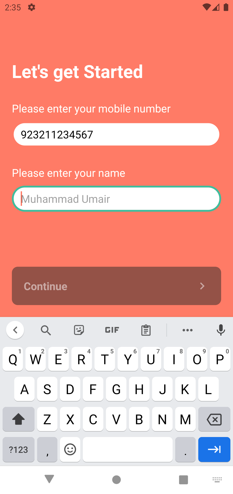
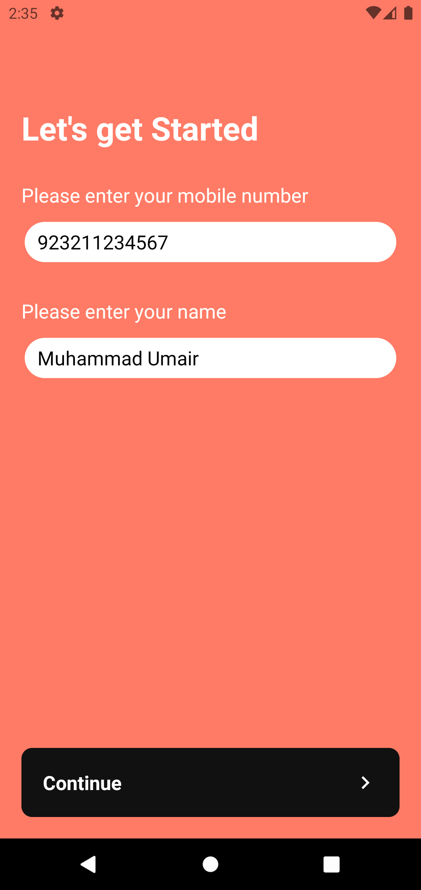
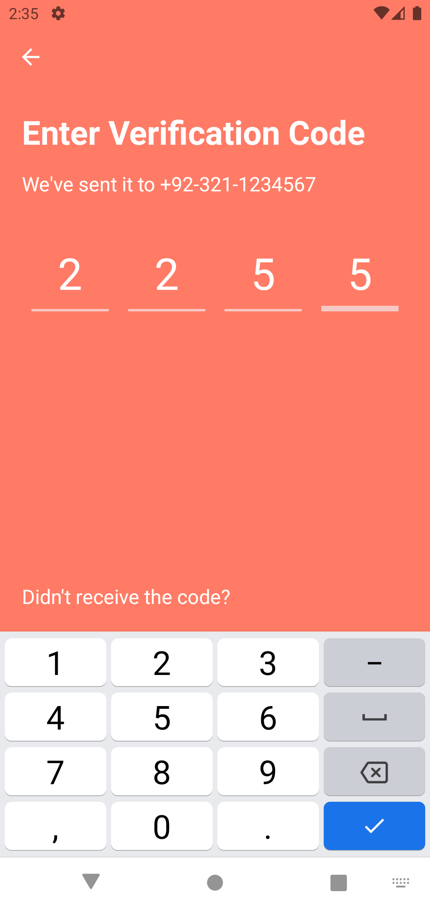
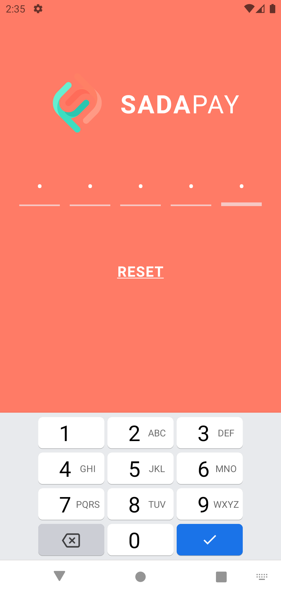
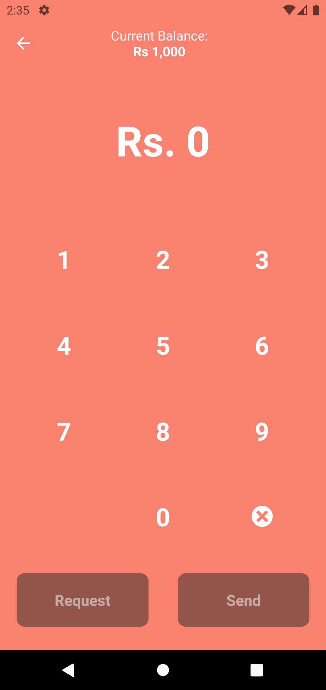
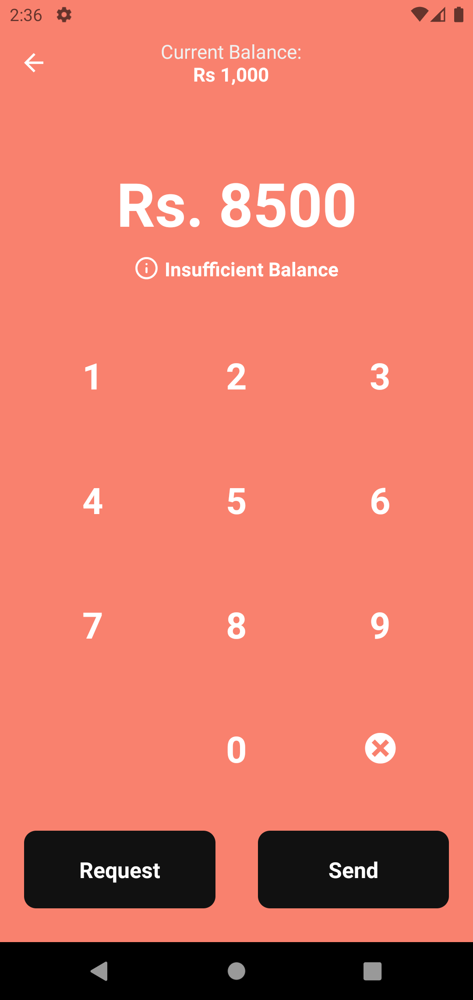
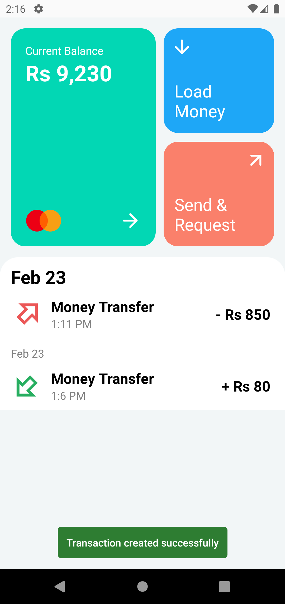
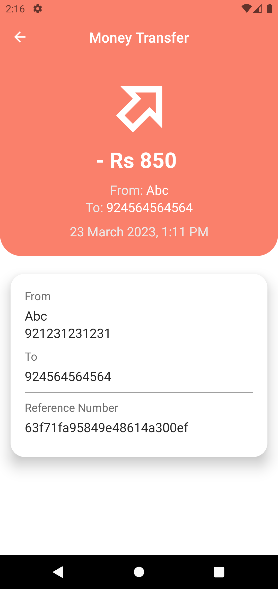

This is a self learning project in which a few of the screens were replicated from the SADAPAY App with Authentication flow using redux and react navigation.

## Backend

[sadapay-clone-server](https://github.com/sudo-umair/sadapay-clone-server)

## Screenshots

